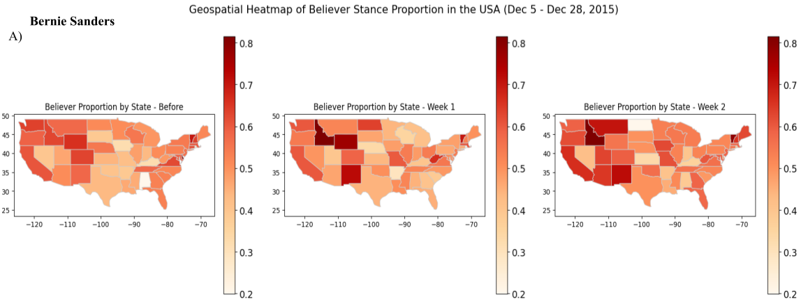
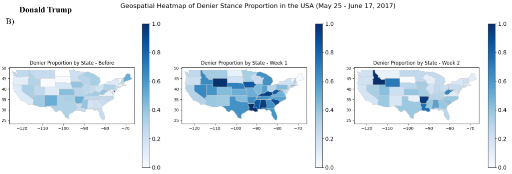

# Understanding Public Perception of Climate Change Through Changes of Stance and Sentiment on Twitter
*iSci 3A12 Climate Change, Fall 2024*

**Group 8: Colin Fife,Ethan Schmidt, Om Thakar, Bob-Shen Yan**  

## Introduction
The goal of this study is to consider the progression of climate change stance and sentiment on Twitter from 2015 to 2018 in the United States (USA). By assessing its progression, it allows for further investigations into the impact on public perception and policies. Twitter represents a platform that is designed to facilitate rapid information engagement. This provides valuable insights into the underlying motivations behind pro- and anti-climate perspectives expressed by the general public and politicians. Additionally, it serves as a platform to evaluate the impact and effectiveness of climate change policies and reforms.

## Methodology
The Twitter data was provided from two datasets:
1. **First Dataset**: A 13-year dataset including all tweet attributes such as `id`, `created_at`, `lng` (longitude), and `lat` (latitude) (Effrosynidis et al. 2022). This dataset included 'seven dimensions' of information, such as `stance`, `sentiment`, and `temperature_avg` (average temperature anomalies), but did not provide full tweet messages.
2. **Second Dataset**: Covered 2015-2018, focused solely on stance classification and full-length tweet messages but did not include timestamps (Qian 2019).

Various methods of visualization were employed to evaluate trends, including line graphs, 2D histograms, N-grams, and geospatial plots.

## Results/Discussion

### Temperature Analysis
The 13 year dataset (2006-2019) offered crucial insights into the temporal and geospatial progression of stance and sentiment. The average temperature deviation and sentiment trends demonstrated only weak correlations between the two factors. However, it did not offer an explanation based on the heatmaps. Instead, it allowed for a deeper understanding of the emotional variability associated with each stance in relation to current literature (Gounaridis and Newell 2024; Painter and Ashe 2012). It was evident that various confounding variables were associated with the impact of temperature deviations on sentiment prompting further analysis. 

### Geospatial Analysis
The second dataset provided a corpus of tweet messages which were depicted using bi- and tri- grams highlighting the major climate event of the Paris Agreement, as well as political figures Bernie Sanders and Donald Trump who were found within top occurrences of the N-grams. The plots were created to temporally and geospatially demonstrate the impact of the following events within the USA:

  - **(A) Bernie Sander's campaign press release on December 12th, 2015 regarding the Paris Agreement**
  - **(B) Donald Trump's official statement of withdrawl from the Paris Agreement on June 1st, 2017**

    
    
    
    *Figure 1: Geospatial heatmaps of climate stances in the USA following political events. (A) Heatmaps represent the believer stance proportion across states before, one week after, and two weeks after Bernie Sanders’s press conference on climate (Dec 5–Dec 28, 2015). (B) Heatmaps represent the denier stance proportion across       states before, one week after, and two weeks after Donald Trump’s withdrawal from the Paris Agreement (May 25–June 17, 2017); (made in Python).*

  - **Sanders’s statements on the Paris Agreement**: Believer stances increased, especially in Vermont and other Democratic-leaning areas
  - **Trump’s withdrawal from the Paris Agreement**: Demonstrated an increase in climate denier stances, particularly in Republican states

## Conclusion
Stance and sentiment trends on Twitter from 2015 to 2018 demonstrated that believer stances experienced an overall increase, while denier stances remained at a consistent level. Temperature anomalies were investigated and revealed that extreme deviations may amplify climate exchange belief. Influence from political figures also shapes public perception, increasing climate discourse on Twitter. Various factors, including political affiliation, affect the susceptibility of different demographics to climate change information. Efforts are also underway to develop multilingual, global datasets to better represent underrepresented regions and languages in climate discourse. 

## Works Cited
1. Effrosynidis, Dimitrios, Alexandros I. Karasakalidis, Georgios Sylaios, and Avi Arampatzis. 2022. ‘The Climate Change Twitter Dataset’. *Expert Systems with Applications* 204 (October): 117541. https://doi.org/10.1016/j.eswa.2022.117541.
2. Gounaridis, Dimitrios, and Joshua P. Newell. 2024. ‘The Social Anatomy of Climate Change Denial in the United States’. *Scientific Reports* 14 (1): 2097. https://doi.org/10.1038/s41598-023-50591-6.
3. Painter, James, and Teresa Ashe. 2012. ‘Cross-National Comparison of the Presence of Climate Scepticism in the Print Media in Six Countries, 2007–10’. *Environmental Research Letters* 7 (4): 044005. https://doi.org/10.1088/1748-9326/7/4/044005.
4. Qian, Edward. 2019. ‘Twitter Climate Change Sentiment Dataset’. 2019. https://www.kaggle.com/datasets/edqian/twitter-climate-change-sentiment-dataset.
